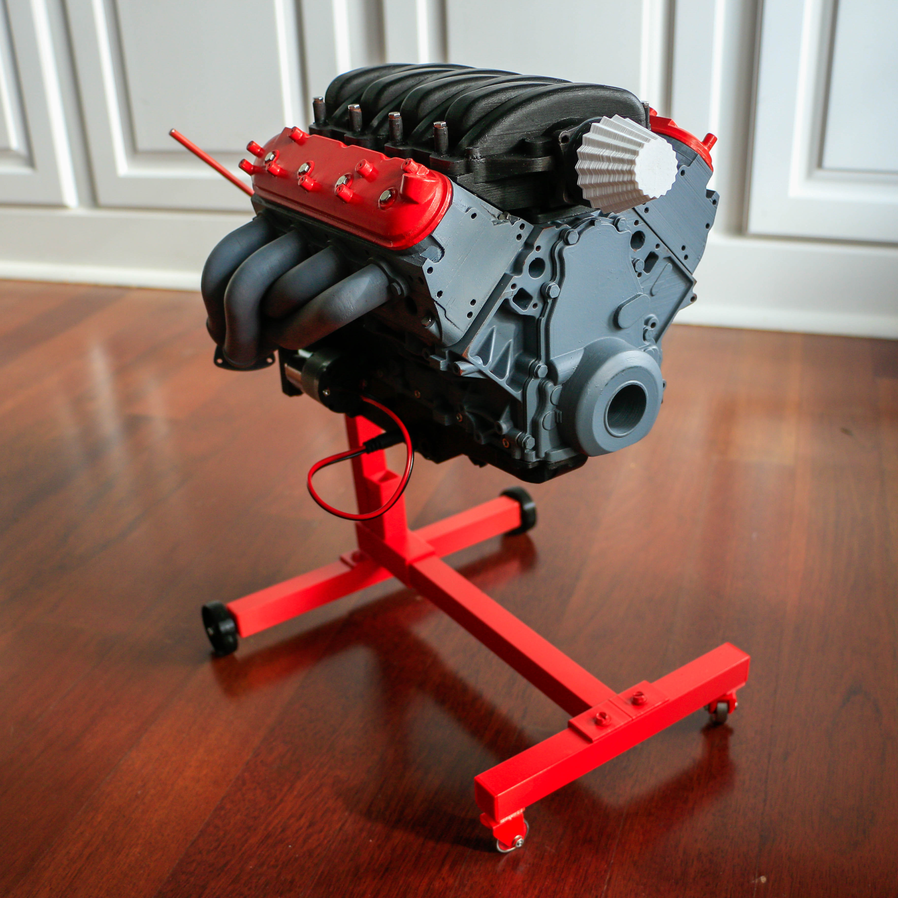
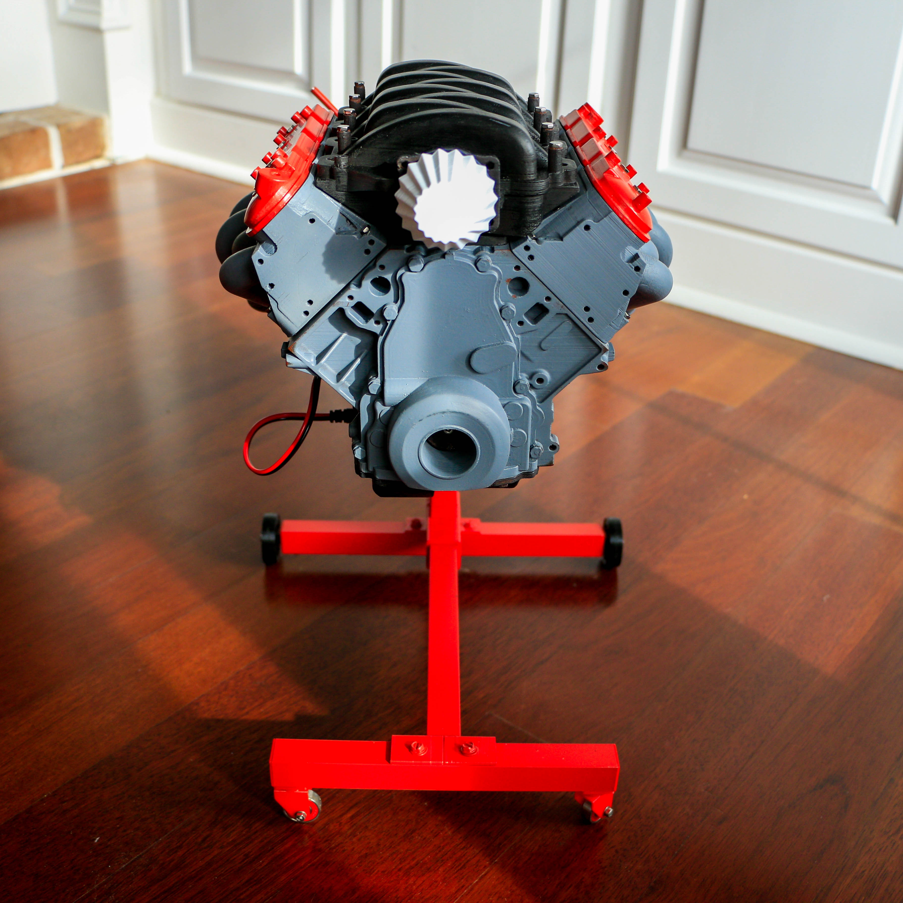
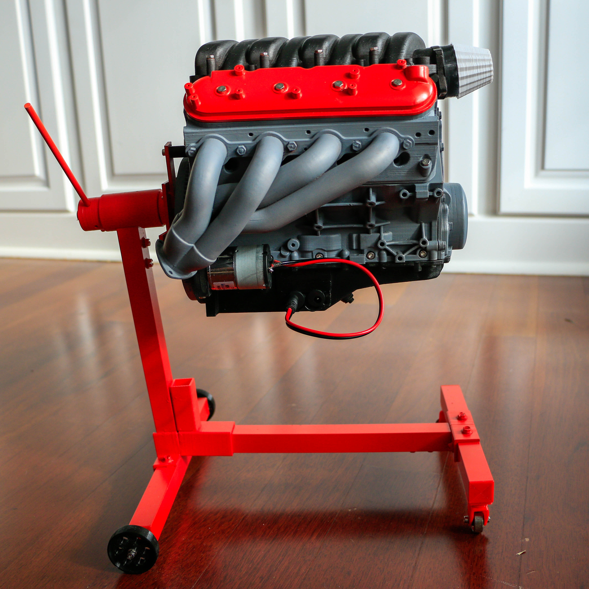
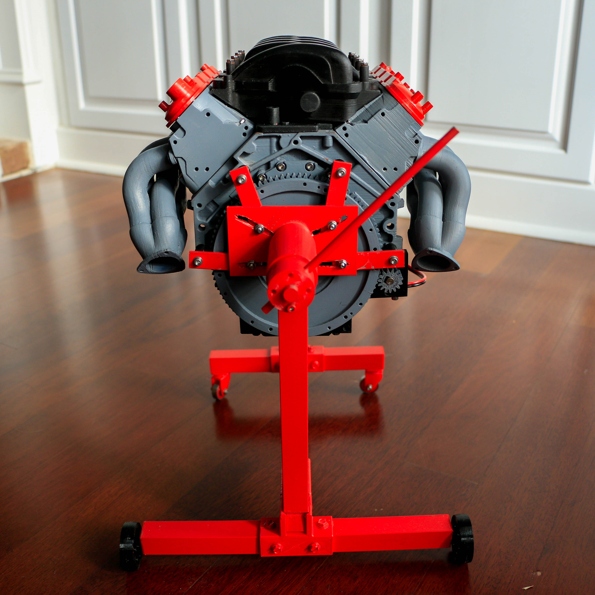
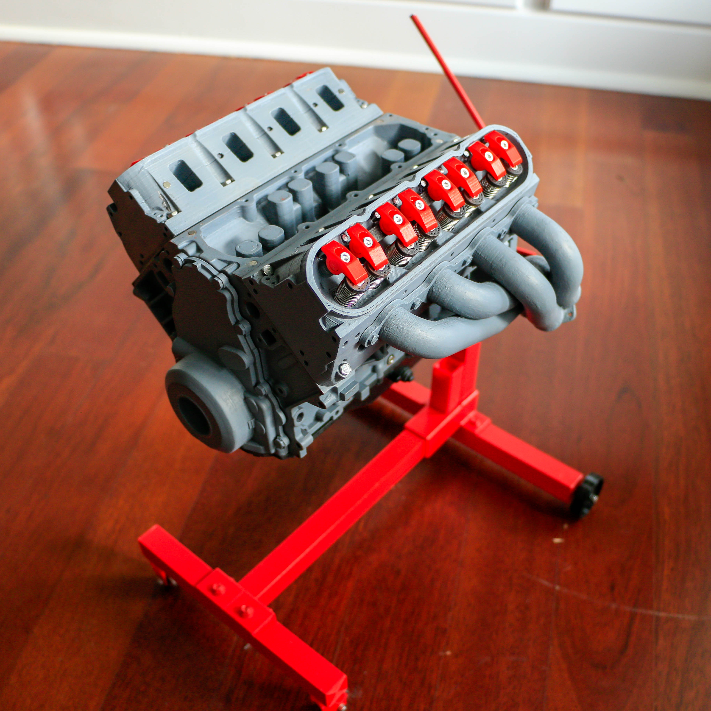
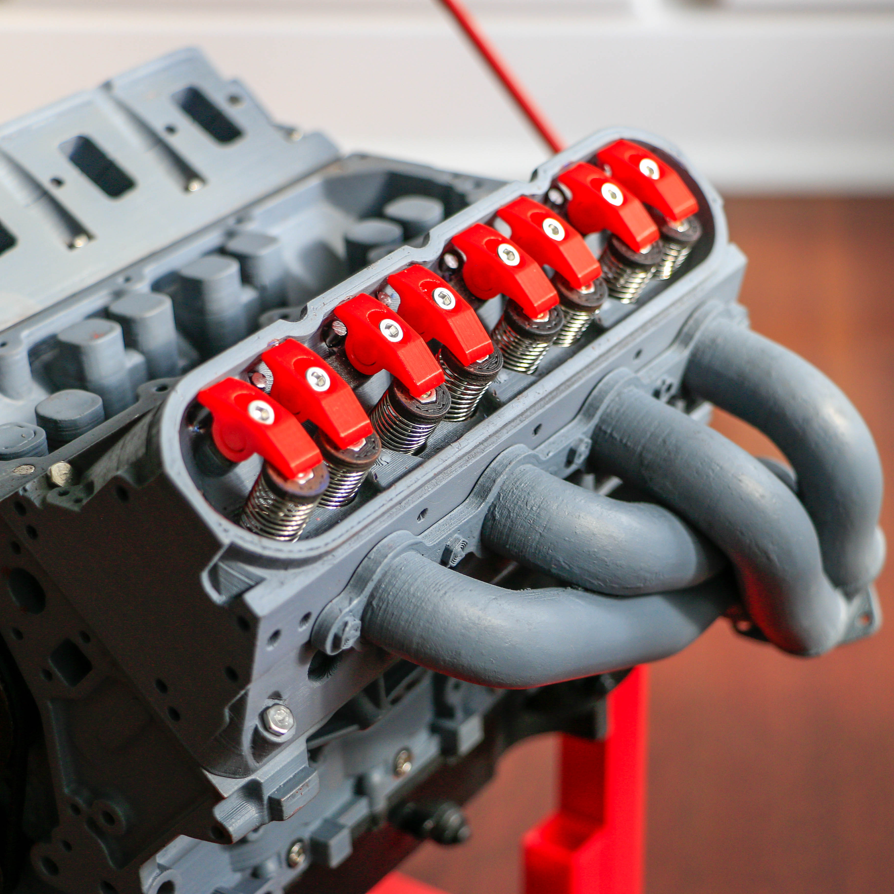
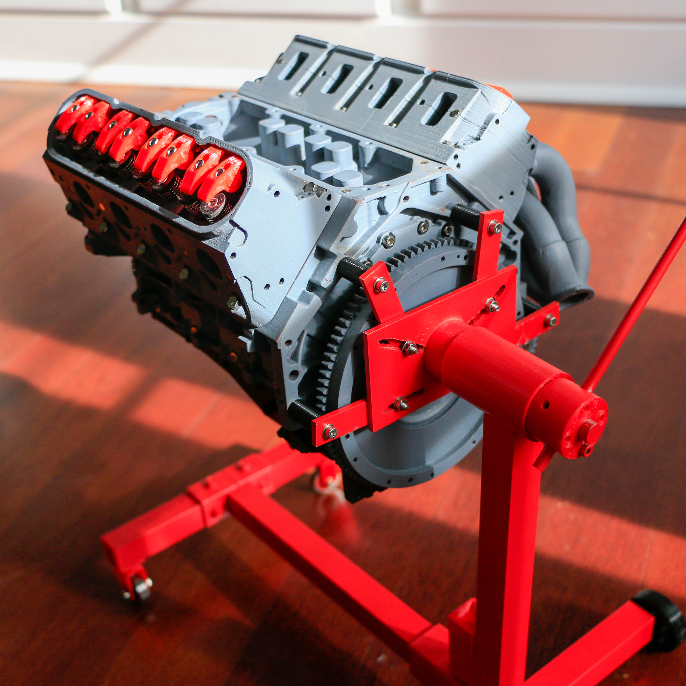
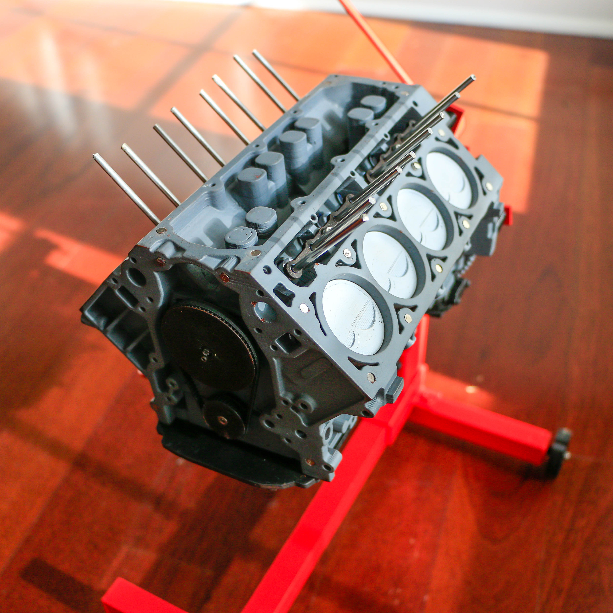
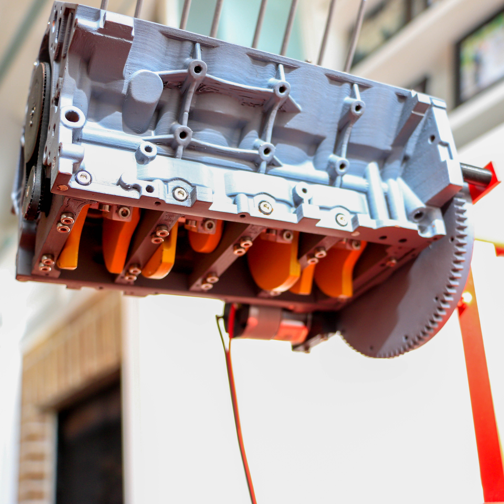

# 3D printed LS3 Camero Engine
Fully 3D printed LS3 Camero engine  
Took 500 hours of printing on a desktop cr-10 printer.  
And 100 hours of sanding, priming, painting and assembling.  

The model was not created by me but rather @ericthepoolboy. He was a few other incredibly detailed engines.  
You can check out my make on Thingiverse here: https://www.thingiverse.com/make:587570  

I have a lot of in progress pictures I took of the build process I would like to add soon and describe how I got to the final. 
